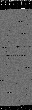
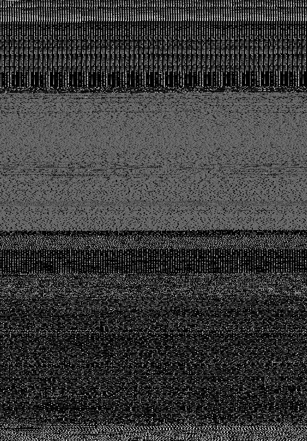

# The VT-May-2020-Android-Image dataset

* To enable malware researchers to compare different classification approaches, we disclose how to create our dataset.

* This dataset contains 164 malware images from 3 different malware families. The original malware binary programs are included in the VirusTotal malwere sample folder.

* If your papers use the dataset or the script-tools for the dataset, please cite the following paper.

* Rikima Mitsuhashi and Takahiro Shinagawa, <br>
"Exploring Optimal Deep Learning Models for Image-based Malware Variant Classification,"<br>
*2022 IEEE 46th Annual Computers, Software, and Applications Conference (COMPSAC), 2022.*

# How to create the dataset
### 1. Apply for access to the VirusTotal Malware Sample Folder

* https://www.virustotal.com/gui/home/upload
* Contact Us -> I have a commercial inquiry -> I am interested in premium services
* There is no charge for an academic account.

### 2. Access to the VirusTotal Malware Sample Folder 

* Download Android.7z from 2020-05-06 folder.

### 3. Unzip the file
* A password is written in the README of the VirusTotal Malware Sample folder.
* Note that unzipped files are real malware.

### 4. Make directory and copy malware files
* The following steps are confirmed in Ubuntu 20.04 LTS.
```
./00_make_directory.sh
```
* Copy your unzipped malware files to "virustotal" directory.
* "/media/user/usb/Android" should be changed to suit your environment.
```
find /media/user/usb/Android -type f | xargs -i cp {} ./virustotal
```
* Check the file type. 
```
file ./virustotal/0063546ac8fed1c45cf92e7d3d5e5cf8bf6cc138a6179bcbe891a920e3f49e76
```
-> Java archive data (JAR)

### 5. Create the dataset
```
sudo apt-get install pnmtopng
```
```
./01_binary_copy.sh
```
```
./02_get_dex.sh
```
```
./03_malwareimage.sh
```
```
./04_image_copy.sh
```


### 6. Check the results
```
zip -r -X VirusTotal-May-2020-Android-Image.zip ./dataset
```
```
sha256sum ./VirusTotal-May-2020-Android-Image.zip
```
-> bde8ff7b7b35834732dbe51230c065f109a67856f6af2f56f3ed8635b484a07c

```
eog ./dataset/01/0f9b5da88755de1b5e9cb4894c5c0b15401cc11f8e38c9429c00e30a4ae832cf.dex.png
```


```
eog ./dataset/02/1fca504cef5b106951ffd3456a9c5a8a80354d8eb942aad464ed40d7d1b7e4e8.dex.png
```


# References
* The VT-May-2020-Windows-Image dataset
* https://github.com/rikima-mitsuhashi/VT-May-2020-Windows-Image
* The DR-20-DEX-Image datase
* https://github.com/rikima-mitsuhashi/DR-20-DEX-Image
